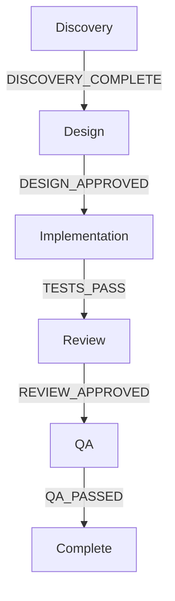

# Future Features Roadmap

> Brainstorm session: 2024-12-10
> Priority areas: AI Collaboration, Automation

---

## Priority Legend

| Icon | Meaning |
|------|---------|
| 🔥 | HIGH PRIORITY - Core functionality |
| 🚀 | MEDIUM PRIORITY - Nice to have |
| 💡 | LOW PRIORITY - Future consideration |
| ⭐ | USER INTEREST - Marked for development |

---

## ⭐ AI ENHANCEMENTS (HIGH INTEREST)

### 1. Agent Collaboration Mode ⭐🔥
**Status:** Planned

Multiple agents working together in real-time on complex tasks.

**Features:**
- Real-time agent-to-agent communication
- Debate/consensus mechanism for decisions
- Peer review between agents
- Shared workspace/context
- Conflict resolution protocol

**Use cases:**
- ARCHITECT-AGENT + SENIOR-DEV discussing implementation approach
- CODE-REVIEWER + QA-AGENT joint review session
- DISCOVERY-AGENT + PM-AGENT requirements refinement

**Technical approach:**
```yaml
collaboration:
  mode: debate | consensus | peer-review
  agents: [ARCHITECT-AGENT, SENIOR-DEV]
  topic: "Database schema design"
  max_rounds: 3
  resolution: majority | unanimous | moderator
  moderator: ORCHESTRATOR
```

---

### 2. Predictive Routing
**Status:** Future

ML model predicts best agent for task based on:
- Task complexity
- Historical performance
- Current agent load
- Skill match score

**Benefits:**
- Faster task completion
- Better quality outcomes
- Reduced retries

---

### 3. Natural Language Workflows
**Status:** Future

Convert natural language to executable workflows.

**Example:**
```
Input: "Create auth system with OAuth and 2FA"

Output: Generated workflow with:
- Discovery phase (requirements)
- Architecture (OAuth provider selection)
- Implementation (login, register, 2FA)
- Testing (security tests)
- Documentation
```

---

## ⭐ AUTOMATION (HIGH INTEREST)

### 4. Workflow Runtime Engine ⭐🔥
**Status:** Planned

Transform YAML workflow definitions into executable pipelines.

**Features:**
- YAML parser → executable workflow
- Real-time gate checking
- Auto-invoke agents in sequence
- Progress tracking dashboard
- Pause/resume capability
- Rollback support

**Architecture:**
```
┌─────────────────────────────────────────────────┐
│              WORKFLOW RUNTIME ENGINE            │
├─────────────────────────────────────────────────┤
│                                                 │
│  ┌─────────┐    ┌─────────┐    ┌─────────┐    │
│  │  YAML   │───▶│ Parser  │───▶│ Engine  │    │
│  │ Config  │    │         │    │         │    │
│  └─────────┘    └─────────┘    └────┬────┘    │
│                                      │         │
│                    ┌─────────────────┼─────┐   │
│                    ▼                 ▼     ▼   │
│              ┌─────────┐      ┌─────────┐     │
│              │  Gate   │      │  Agent  │     │
│              │ Checker │      │ Invoker │     │
│              └─────────┘      └─────────┘     │
│                                               │
└───────────────────────────────────────────────┘
```

**API Example:**
```typescript
const engine = new WorkflowEngine();

// Load workflow
const workflow = engine.load('epic-workflow.yaml');

// Execute with callbacks
workflow.execute({
  onPhaseStart: (phase) => console.log(`Starting: ${phase}`),
  onGateCheck: (gate, result) => handleGate(gate, result),
  onAgentInvoke: (agent, task) => trackAgent(agent, task),
  onComplete: (result) => notifyUser(result)
});

// Real-time status
workflow.getStatus(); // { phase: 'implementation', progress: 65%, agents: [...] }
```

---

### 5. Auto-Healing Workflows ⭐🔥
**Status:** Planned

Self-correcting pipelines that recover from failures automatically.

**Features:**
- Automatic retry with different strategy
- Fallback to alternative agent
- Self-diagnosis of failure cause
- Learning from past failures
- Automatic rollback on critical failure

**Logic:**
```yaml
auto_healing:
  on_failure:
    - retry_same_agent: 2
    - try_alternative_agent: true
    - escalate_to: SENIOR-DEV
    - if_still_failing: rollback

  learning:
    store_failure_patterns: true
    suggest_improvements: true
```

**Recovery paths:**
```
Gate Failed
    │
    ├──▶ Retry (max 2)
    │       │
    │       └──▶ Success? ──▶ Continue
    │
    ├──▶ Alternative Agent
    │       │
    │       └──▶ Success? ──▶ Continue
    │
    ├──▶ Escalate to Senior
    │       │
    │       └──▶ Success? ──▶ Continue
    │
    └──▶ Rollback + Notify User
```

---

### 6. CI/CD Integration ⭐
**Status:** Planned

Integrate workflows with CI/CD pipelines.

**GitHub Actions Integration:**
```yaml
# .github/workflows/agent-workflow.yml
name: Agent Workflow
on: [pull_request]

jobs:
  agent-review:
    runs-on: ubuntu-latest
    steps:
      - uses: actions/checkout@v4

      - name: Run Code Review Agent
        uses: agent-methodology/code-reviewer@v1
        with:
          workflow: story-delivery
          phase: code_review

      - name: Run QA Agent
        uses: agent-methodology/qa-agent@v1
        with:
          workflow: story-delivery
          phase: qa_testing
```

**Features:**
- Auto-trigger agents on PR/commit
- Gate validation in CI
- Block merge until gates pass
- Status checks integration

---

### 7. Slack/Discord Bot
**Status:** Future

Real-time notifications and interactions.

**Commands:**
```
/workflow status epic-123     → Progress report
/workflow approve gate-456    → Approve gate
/workflow agents              → List active agents
/workflow metrics             → Performance dashboard
```

**Notifications:**
- Gate passed/failed
- Agent completed task
- Workflow blocked (needs attention)
- Daily summary

---

## 🔥 HIGH IMPACT

### 8. Agent Memory / Context Persistence
**Status:** Future

Agents remember previous sessions and share knowledge.

**Features:**
- Per-project memory
- Cross-session context
- Shared knowledge base
- Learning from decisions

**Storage:**
```yaml
agent_memory:
  project: "e-commerce-platform"
  agent: ARCHITECT-AGENT
  memories:
    - type: decision
      date: 2024-12-01
      context: "Chose PostgreSQL over MongoDB"
      reasoning: "Relational data, ACID compliance needed"
    - type: pattern
      context: "Auth implementation"
      learned: "Always use refresh tokens"
```

---

### 9. Workflow Templates Generator
**Status:** Future

Generate custom workflows from templates.

**Usage:**
```bash
/new-workflow --template=feature --name="user-auth" --include=oauth,2fa
```

**Output:** Complete workflow YAML with:
- Relevant phases
- Appropriate agents
- Custom gates
- Documentation stubs

---

## 📊 ANALYTICS & INSIGHTS

### 10. Workflow Analytics Dashboard
**Status:** Future

Visual dashboard for workflow performance.

**Metrics:**
- Time per phase/gate
- Agent performance (success rate, avg time)
- Bottleneck detection
- Velocity trends
- Cost per workflow

**Visualization:**
```
┌─────────────────────────────────────────────────────────┐
│                 WORKFLOW DASHBOARD                       │
├─────────────────────────────────────────────────────────┤
│                                                          │
│  Active Workflows: 3        Completed Today: 12         │
│                                                          │
│  ┌──────────────────────────────────────────────────┐   │
│  │ Epic-123: User Auth  [████████░░] 80%            │   │
│  │ Story-456: Login     [██████████] 100% ✓         │   │
│  │ Bug-789: Fix crash   [████░░░░░░] 40%            │   │
│  └──────────────────────────────────────────────────┘   │
│                                                          │
│  Agent Performance (24h):                                │
│  CODE-REVIEWER: 95% success | avg 12min                 │
│  QA-AGENT: 88% success | avg 25min                      │
│  TEST-WRITER: 92% success | avg 18min                   │
│                                                          │
└─────────────────────────────────────────────────────────┘
```

---

### 11. Cost Tracking
**Status:** Future

Monitor and optimize AI costs.

**Features:**
- Token usage per agent/workflow
- Model selection optimization
- Budget alerts
- Cost predictions

---

## 🧩 EXTENSIBILITY

### 12. Plugin System
**Status:** Future

Extend functionality with plugins.

**Plugin types:**
- Custom agents
- New gate types
- Integrations (Jira, Linear, etc.)
- Skill packs

**Plugin structure:**
```
plugins/
├── my-custom-agent/
│   ├── plugin.yaml
│   ├── agent.md
│   └── skills/
└── jira-integration/
    ├── plugin.yaml
    └── gates/
```

---

### 13. Custom Gate Types
**Status:** Future

User-defined gate logic.

**Examples:**
- External API validation (Jira status check)
- Human approval via email/Slack
- Time-based gates (wait for deploy window)
- Composite gates (multiple conditions)

```yaml
custom_gate:
  type: external_api
  name: JIRA_STATUS_CHECK
  endpoint: "https://jira.company.com/api/issue/{id}/status"
  expected: "Ready for Dev"
  on_mismatch: block
```

---

## 🔒 ENTERPRISE

### 14. Role-Based Access Control (RBAC)
**Status:** Future

Control who can do what.

**Roles:**
- Admin: Full access
- Lead: Approve gates, modify workflows
- Developer: Execute workflows
- Viewer: Read-only

**Permissions:**
```yaml
roles:
  developer:
    can_execute: [story-delivery, bug-workflow]
    can_approve_gates: false
    can_modify_workflows: false

  lead:
    can_execute: all
    can_approve_gates: true
    can_modify_workflows: false
```

---

### 15. Multi-Team Support
**Status:** Future

Support for multiple teams with:
- Team-specific workflows
- Cross-team dependencies
- Resource sharing
- Team dashboards

---

### 16. Compliance & Governance
**Status:** Future

For regulated industries:
- SOC2/GDPR workflow templates
- Mandatory gates
- Audit trail
- Approval chains

---

## 💡 QUICK WINS

### 17. Workflow Visualization
**Status:** Future

Generate visual diagrams from YAML.

**Outputs:**
- Mermaid diagrams
- D2 diagrams
- Interactive web view
- Real-time status overlay

**Example output:**


---

### 18. Skill Auto-Discovery
**Status:** Future

Automatically discover and suggest skills.

**Features:**
- Scan codebase → suggest relevant skills
- Auto-update skills from official docs
- Freshness monitoring
- Deprecation alerts

---

## 🔧 QUICK WINS (1-2 days each)

### 19. Agent Health Check
**Status:** Future

Check agent "health" before invocation.

**Features:**
- Timeout detection
- Fallback to alternative agent
- Pre-flight checks
- Circuit breaker pattern

---

### 20. Workflow Dry Run
**Status:** Future

Simulate workflow without execution.

**Usage:**
```bash
/dry-run epic-workflow
```

**Output:**
- Agent invocation order
- Gates to pass
- Estimated time & cost
- Potential blockers

---

### 21. Gate Skip with Reason
**Status:** Future

Allow gate skip with mandatory justification.

```yaml
gate_skip:
  gate: REVIEW_APPROVED
  reason: "Hotfix - reviewed offline by @lead"
  approved_by: lead@company.com
  logged_to: audit_trail
```

---

### 22. Agent Aliases
**Status:** Future

Shortcuts for common agent selections.

| Alias | Resolves To |
|-------|-------------|
| `@dev` | BACKEND-DEV or FRONTEND-DEV (auto-detect) |
| `@test` | TEST-WRITER |
| `@review` | CODE-REVIEWER |
| `@qa` | QA-AGENT |

---

### 23. Workflow Bookmarks
**Status:** Future

Save and restore workflow state.

**Features:**
- Save checkpoint before risky operations
- Return to bookmark on failure
- Named bookmarks
- Auto-bookmark on gate pass

---

### 24. Quick Status Command
**Status:** Future

One-liner status for all workflows.

```bash
/status                    # All active workflows
/status epic-123           # Specific workflow details
/status --agent CODE-REVIEWER  # Agent activity
```

---

### 25. Agent Performance Tags
**Status:** Future

Control agent behavior with tags.

| Tag | Effect |
|-----|--------|
| `#fast` | Speed over thoroughness |
| `#thorough` | Deep analysis, slower |
| `#creative` | More exploration |
| `#strict` | By-the-book only |

---

## 📦 MEDIUM FEATURES (1-2 weeks each)

### 26. Workflow Inheritance
**Status:** Future

Extend existing workflows.

```yaml
# quick-feature.yaml
extends: feature-flow.yaml
skip_phases: [ux_check, qa]
override:
  review:
    model: haiku  # faster for small changes
```

---

### 27. Conditional Phases
**Status:** Future

Run phases based on conditions.

```yaml
phases:
  security_audit:
    condition: "changes.includes('auth') || changes.includes('payment')"
    agent: SECURITY-REVIEWER

  performance_check:
    condition: "changes.includes('database') || file_count > 20"
    agent: PERFORMANCE-ANALYST
```

---

### 28. Parallel Gate Evaluation
**Status:** Future

Check multiple gates simultaneously.

**Benefits:**
- Faster workflow progression
- Early fail detection
- Reduced wait times

```yaml
parallel_gates:
  - TESTS_PASS
  - LINT_CLEAN
  - SECURITY_SCAN
wait_for: all  # or: any, majority
```

---

### 29. Agent Specialization Profiles
**Status:** Future

Same agent, different configurations.

```yaml
# BACKEND-DEV profiles
profiles:
  api-specialist:
    skills: [api-rest-design, api-validation]
    model: opus
    style: "Focus on API design patterns"

  db-specialist:
    skills: [postgres, migrations]
    model: sonnet
    style: "Focus on query optimization"
```

---

### 30. Workflow Fragments (Reusable Blocks)
**Status:** Future

Define reusable workflow pieces.

```yaml
# fragments/tdd-block.yaml
fragment: tdd
steps:
  - red_phase
  - green_phase
  - refactor_phase

# In main workflow:
phases:
  implementation:
    use_fragment: tdd
    config:
      strict_coverage: true
```

---

### 31. Smart Retries
**Status:** Future

Intelligent retry with learning.

```yaml
retry:
  strategy: exponential_backoff
  max_attempts: 3
  on_failure:
    analyze_error: true      # Agent analyzes what went wrong
    adjust_approach: true    # Changes strategy based on analysis
    remember_failure: true   # Prevents same mistake
```

---

### 32. Context Compression
**Status:** Future

Auto-summarize long contexts.

**Features:**
- Intelligent summarization
- Key information preservation
- Token usage reduction (up to 60%)
- Configurable compression levels

---

### 33. Workflow Diff
**Status:** Future

Compare workflow versions.

```bash
/diff workflow-v1.yaml workflow-v2.yaml
```

**Output:**
- Added/removed phases
- Changed gates
- Agent modifications
- Migration guide

---

## 🚀 LARGE FEATURES (1+ month each)

### 34. Visual Workflow Editor
**Status:** Future

GUI for workflow creation.

**Features:**
- Drag & drop phases
- Connect gates visually
- Live YAML preview
- Export/import
- Template library

---

### 35. Agent Marketplace
**Status:** Future

Community and premium agents.

```
marketplace/
├── community-agents/
│   ├── security-auditor/
│   ├── performance-optimizer/
│   ├── accessibility-checker/
│   └── i18n-reviewer/
└── premium-agents/
    ├── compliance-reviewer/
    └── architecture-advisor/
```

---

### 36. Workflow Versioning & Rollback
**Status:** Future

Full version control for workflows.

```bash
/workflow history epic-workflow
/workflow rollback epic-workflow --to=v2.3
/workflow compare v2.3 v2.4
/workflow tag v3.0 --message="Production ready"
```

---

### 37. Multi-Project Orchestration
**Status:** Future

Workflows spanning multiple repositories.

**Features:**
- Cross-repo dependencies
- Monorepo support
- Shared agents across projects
- Unified dashboard

---

### 38. Real-Time Collaboration
**Status:** Future

Multiple users on same workflow.

**Features:**
- Live status updates
- Shared cursor positions
- In-workflow chat
- Collaborative gate approval

---

### 39. Workflow Testing Framework
**Status:** Future

Test workflows before deployment.

```yaml
# workflow-tests/epic-workflow.test.yaml
tests:
  - name: "Happy path"
    mock_agents: true
    expect_phases: [discovery, design, implementation]
    expect_gates_pass: all

  - name: "Gate failure recovery"
    inject_failure: REVIEW_APPROVED
    expect_recovery: return_to_implementation

  - name: "Timeout handling"
    inject_timeout: green_phase
    expect: escalation_to_senior
```

---

### 40. AI Workflow Optimizer
**Status:** Future

ML-powered workflow improvements.

**Suggestions:**
- "This gate fails 40% of the time - consider adding pre-check"
- "Phase X always takes 3x longer on Mondays"
- "Agent Y performs better with Opus model for this task"

---

### 41. Natural Language Queries
**Status:** Future

Ask questions about workflows in plain English.

```
"Why did epic-123 take so long?"
→ "Implementation phase took 3x longer due to 2 failed code reviews.
   Root cause: Missing unit tests.
   Suggestion: Add lint check before review."

"Which agent is best for auth tasks?"
→ "BACKEND-DEV with api-specialist profile has 94% success rate
   for authentication tasks. Average completion: 45 min."
```

---

### 42. Predictive ETAs
**Status:** Future

ML-based completion time predictions.

**Factors:**
- Task complexity
- Team velocity history
- Current workload
- Time of day/week
- Historical similar tasks

**Output:**
- Estimated completion time
- Confidence interval
- Risk factors
- Real-time updates

---

### 43. Workflow Observability
**Status:** Future

Full observability stack.

```yaml
observability:
  tracing: opentelemetry
  metrics: prometheus
  logs: structured_json

  alerts:
    - condition: gate_stuck > 2h
      notify: slack
    - condition: error_rate > 20%
      notify: pagerduty
    - condition: cost > $100/day
      notify: email
```

---

## 🎯 SPECIAL FEATURES (Niche but Powerful)

### 44. Voice Control
**Status:** Future

Voice commands for workflows.

**Examples:**
- "Hey Claude, start code review for PR 123"
- "What's the status of my epic?"
- "Approve the QA gate"
- "Pause the current workflow"

---

### 45. Mobile App
**Status:** Future

Workflow management on the go.

**Features:**
- Push notifications for gates
- Quick approve/reject
- Status dashboard
- Voice commands

---

### 46. Workflow Simulation Mode
**Status:** Future

"What if" scenario testing.

**Use cases:**
- Test workflow changes before deploy
- Compare different approaches
- Training new team members
- Demo workflows to stakeholders

---

### 47. Agent Personas
**Status:** Future

Different "personalities" for same agent.

```yaml
personas:
  strict_reviewer:
    agent: CODE-REVIEWER
    style: "Very strict, security-focused, no mercy"
    focus: [security, performance, edge-cases]

  mentor_reviewer:
    agent: CODE-REVIEWER
    style: "Educational, explains issues, suggests learning resources"
    focus: [best-practices, learning, improvement]

  quick_reviewer:
    agent: CODE-REVIEWER
    style: "Fast, focuses on critical issues only"
    focus: [bugs, security, breaking-changes]
```

---

### 48. Cross-Workflow Dependencies
**Status:** Future

Workflows that depend on or trigger other workflows.

```yaml
# epic-workflow.yaml
dependencies:
  wait_for:
    - workflow: infrastructure-setup
      gate: DEPLOYED
    - workflow: database-migration
      gate: MIGRATED

  triggers:
    - workflow: monitoring-setup
      on: COMPLETE
    - workflow: documentation-update
      on: COMPLETE
```

---

## Implementation Priority

### Phase 1: Foundation (Q1)
1. ⭐ Workflow Runtime Engine
2. ⭐ Auto-Healing Workflows
3. Workflow Visualization
4. Agent Health Check
5. Workflow Dry Run

### Phase 2: Collaboration (Q2)
6. ⭐ Agent Collaboration Mode
7. Agent Memory / Context
8. CI/CD Integration
9. Workflow Inheritance
10. Agent Specialization Profiles

### Phase 3: Scale (Q3)
11. Analytics Dashboard
12. Plugin System
13. Slack/Discord Bot
14. Workflow Testing Framework
15. Smart Retries

### Phase 4: Enterprise (Q4)
16. RBAC
17. Multi-Team Support
18. Compliance & Governance
19. Workflow Versioning
20. Multi-Project Orchestration

### Phase 5: Advanced AI (Future)
21. AI Workflow Optimizer
22. Natural Language Queries
23. Predictive ETAs
24. Agent Personas
25. Voice Control

---

## Contributing

Want to help build these features?

1. Pick a feature from the roadmap
2. Create an issue with `[FEATURE]` prefix
3. Discuss approach in the issue
4. Submit PR when ready

---

## Feedback

Have ideas for new features?

- Open an issue with `[IDEA]` prefix
- Join our discussions
- Vote on existing feature requests

---

*Last updated: 2025-12-10*
