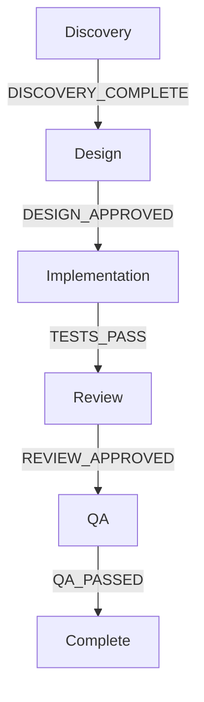

# Future Features Roadmap

> Brainstorm session: 2024-12-10
> Priority areas: AI Collaboration, Automation

---

## Priority Legend

| Icon | Meaning |
|------|---------|
| 🔥 | HIGH PRIORITY - Core functionality |
| 🚀 | MEDIUM PRIORITY - Nice to have |
| 💡 | LOW PRIORITY - Future consideration |
| ⭐ | USER INTEREST - Marked for development |

---

## ⭐ AI ENHANCEMENTS (HIGH INTEREST)

### 1. Agent Collaboration Mode ⭐🔥
**Status:** Planned

Multiple agents working together in real-time on complex tasks.

**Features:**
- Real-time agent-to-agent communication
- Debate/consensus mechanism for decisions
- Peer review between agents
- Shared workspace/context
- Conflict resolution protocol

**Use cases:**
- ARCHITECT-AGENT + SENIOR-DEV discussing implementation approach
- CODE-REVIEWER + QA-AGENT joint review session
- DISCOVERY-AGENT + PM-AGENT requirements refinement

**Technical approach:**
```yaml
collaboration:
  mode: debate | consensus | peer-review
  agents: [ARCHITECT-AGENT, SENIOR-DEV]
  topic: "Database schema design"
  max_rounds: 3
  resolution: majority | unanimous | moderator
  moderator: ORCHESTRATOR
```

---

### 2. Predictive Routing
**Status:** Future

ML model predicts best agent for task based on:
- Task complexity
- Historical performance
- Current agent load
- Skill match score

**Benefits:**
- Faster task completion
- Better quality outcomes
- Reduced retries

---

### 3. Natural Language Workflows
**Status:** Future

Convert natural language to executable workflows.

**Example:**
```
Input: "Create auth system with OAuth and 2FA"

Output: Generated workflow with:
- Discovery phase (requirements)
- Architecture (OAuth provider selection)
- Implementation (login, register, 2FA)
- Testing (security tests)
- Documentation
```

---

## ⭐ AUTOMATION (HIGH INTEREST)

### 4. Workflow Runtime Engine ⭐🔥
**Status:** Planned

Transform YAML workflow definitions into executable pipelines.

**Features:**
- YAML parser → executable workflow
- Real-time gate checking
- Auto-invoke agents in sequence
- Progress tracking dashboard
- Pause/resume capability
- Rollback support

**Architecture:**
```
┌─────────────────────────────────────────────────┐
│              WORKFLOW RUNTIME ENGINE            │
├─────────────────────────────────────────────────┤
│                                                 │
│  ┌─────────┐    ┌─────────┐    ┌─────────┐    │
│  │  YAML   │───▶│ Parser  │───▶│ Engine  │    │
│  │ Config  │    │         │    │         │    │
│  └─────────┘    └─────────┘    └────┬────┘    │
│                                      │         │
│                    ┌─────────────────┼─────┐   │
│                    ▼                 ▼     ▼   │
│              ┌─────────┐      ┌─────────┐     │
│              │  Gate   │      │  Agent  │     │
│              │ Checker │      │ Invoker │     │
│              └─────────┘      └─────────┘     │
│                                               │
└───────────────────────────────────────────────┘
```

**API Example:**
```typescript
const engine = new WorkflowEngine();

// Load workflow
const workflow = engine.load('epic-workflow.yaml');

// Execute with callbacks
workflow.execute({
  onPhaseStart: (phase) => console.log(`Starting: ${phase}`),
  onGateCheck: (gate, result) => handleGate(gate, result),
  onAgentInvoke: (agent, task) => trackAgent(agent, task),
  onComplete: (result) => notifyUser(result)
});

// Real-time status
workflow.getStatus(); // { phase: 'implementation', progress: 65%, agents: [...] }
```

---

### 5. Auto-Healing Workflows ⭐🔥
**Status:** Planned

Self-correcting pipelines that recover from failures automatically.

**Features:**
- Automatic retry with different strategy
- Fallback to alternative agent
- Self-diagnosis of failure cause
- Learning from past failures
- Automatic rollback on critical failure

**Logic:**
```yaml
auto_healing:
  on_failure:
    - retry_same_agent: 2
    - try_alternative_agent: true
    - escalate_to: SENIOR-DEV
    - if_still_failing: rollback

  learning:
    store_failure_patterns: true
    suggest_improvements: true
```

**Recovery paths:**
```
Gate Failed
    │
    ├──▶ Retry (max 2)
    │       │
    │       └──▶ Success? ──▶ Continue
    │
    ├──▶ Alternative Agent
    │       │
    │       └──▶ Success? ──▶ Continue
    │
    ├──▶ Escalate to Senior
    │       │
    │       └──▶ Success? ──▶ Continue
    │
    └──▶ Rollback + Notify User
```

---

### 6. CI/CD Integration ⭐
**Status:** Planned

Integrate workflows with CI/CD pipelines.

**GitHub Actions Integration:**
```yaml
# .github/workflows/agent-workflow.yml
name: Agent Workflow
on: [pull_request]

jobs:
  agent-review:
    runs-on: ubuntu-latest
    steps:
      - uses: actions/checkout@v4

      - name: Run Code Review Agent
        uses: agent-methodology/code-reviewer@v1
        with:
          workflow: story-delivery
          phase: code_review

      - name: Run QA Agent
        uses: agent-methodology/qa-agent@v1
        with:
          workflow: story-delivery
          phase: qa_testing
```

**Features:**
- Auto-trigger agents on PR/commit
- Gate validation in CI
- Block merge until gates pass
- Status checks integration

---

### 7. Slack/Discord Bot
**Status:** Future

Real-time notifications and interactions.

**Commands:**
```
/workflow status epic-123     → Progress report
/workflow approve gate-456    → Approve gate
/workflow agents              → List active agents
/workflow metrics             → Performance dashboard
```

**Notifications:**
- Gate passed/failed
- Agent completed task
- Workflow blocked (needs attention)
- Daily summary

---

## 🔥 HIGH IMPACT

### 8. Agent Memory / Context Persistence
**Status:** Future

Agents remember previous sessions and share knowledge.

**Features:**
- Per-project memory
- Cross-session context
- Shared knowledge base
- Learning from decisions

**Storage:**
```yaml
agent_memory:
  project: "e-commerce-platform"
  agent: ARCHITECT-AGENT
  memories:
    - type: decision
      date: 2024-12-01
      context: "Chose PostgreSQL over MongoDB"
      reasoning: "Relational data, ACID compliance needed"
    - type: pattern
      context: "Auth implementation"
      learned: "Always use refresh tokens"
```

---

### 9. Workflow Templates Generator
**Status:** Future

Generate custom workflows from templates.

**Usage:**
```bash
/new-workflow --template=feature --name="user-auth" --include=oauth,2fa
```

**Output:** Complete workflow YAML with:
- Relevant phases
- Appropriate agents
- Custom gates
- Documentation stubs

---

## 📊 ANALYTICS & INSIGHTS

### 10. Workflow Analytics Dashboard
**Status:** Future

Visual dashboard for workflow performance.

**Metrics:**
- Time per phase/gate
- Agent performance (success rate, avg time)
- Bottleneck detection
- Velocity trends
- Cost per workflow

**Visualization:**
```
┌─────────────────────────────────────────────────────────┐
│                 WORKFLOW DASHBOARD                       │
├─────────────────────────────────────────────────────────┤
│                                                          │
│  Active Workflows: 3        Completed Today: 12         │
│                                                          │
│  ┌──────────────────────────────────────────────────┐   │
│  │ Epic-123: User Auth  [████████░░] 80%            │   │
│  │ Story-456: Login     [██████████] 100% ✓         │   │
│  │ Bug-789: Fix crash   [████░░░░░░] 40%            │   │
│  └──────────────────────────────────────────────────┘   │
│                                                          │
│  Agent Performance (24h):                                │
│  CODE-REVIEWER: 95% success | avg 12min                 │
│  QA-AGENT: 88% success | avg 25min                      │
│  TEST-WRITER: 92% success | avg 18min                   │
│                                                          │
└─────────────────────────────────────────────────────────┘
```

---

### 11. Cost Tracking
**Status:** Future

Monitor and optimize AI costs.

**Features:**
- Token usage per agent/workflow
- Model selection optimization
- Budget alerts
- Cost predictions

---

## 🧩 EXTENSIBILITY

### 12. Plugin System
**Status:** Future

Extend functionality with plugins.

**Plugin types:**
- Custom agents
- New gate types
- Integrations (Jira, Linear, etc.)
- Skill packs

**Plugin structure:**
```
plugins/
├── my-custom-agent/
│   ├── plugin.yaml
│   ├── agent.md
│   └── skills/
└── jira-integration/
    ├── plugin.yaml
    └── gates/
```

---

### 13. Custom Gate Types
**Status:** Future

User-defined gate logic.

**Examples:**
- External API validation (Jira status check)
- Human approval via email/Slack
- Time-based gates (wait for deploy window)
- Composite gates (multiple conditions)

```yaml
custom_gate:
  type: external_api
  name: JIRA_STATUS_CHECK
  endpoint: "https://jira.company.com/api/issue/{id}/status"
  expected: "Ready for Dev"
  on_mismatch: block
```

---

## 🔒 ENTERPRISE

### 14. Role-Based Access Control (RBAC)
**Status:** Future

Control who can do what.

**Roles:**
- Admin: Full access
- Lead: Approve gates, modify workflows
- Developer: Execute workflows
- Viewer: Read-only

**Permissions:**
```yaml
roles:
  developer:
    can_execute: [story-delivery, bug-workflow]
    can_approve_gates: false
    can_modify_workflows: false

  lead:
    can_execute: all
    can_approve_gates: true
    can_modify_workflows: false
```

---

### 15. Multi-Team Support
**Status:** Future

Support for multiple teams with:
- Team-specific workflows
- Cross-team dependencies
- Resource sharing
- Team dashboards

---

### 16. Compliance & Governance
**Status:** Future

For regulated industries:
- SOC2/GDPR workflow templates
- Mandatory gates
- Audit trail
- Approval chains

---

## 💡 QUICK WINS

### 17. Workflow Visualization
**Status:** Future

Generate visual diagrams from YAML.

**Outputs:**
- Mermaid diagrams
- D2 diagrams
- Interactive web view
- Real-time status overlay

**Example output:**


---

### 18. Skill Auto-Discovery
**Status:** Future

Automatically discover and suggest skills.

**Features:**
- Scan codebase → suggest relevant skills
- Auto-update skills from official docs
- Freshness monitoring
- Deprecation alerts

---

## Implementation Priority

### Phase 1: Foundation (Q1)
1. ⭐ Workflow Runtime Engine
2. ⭐ Auto-Healing Workflows
3. Workflow Visualization

### Phase 2: Collaboration (Q2)
4. ⭐ Agent Collaboration Mode
5. Agent Memory / Context
6. CI/CD Integration

### Phase 3: Scale (Q3)
7. Analytics Dashboard
8. Plugin System
9. Slack/Discord Bot

### Phase 4: Enterprise (Q4)
10. RBAC
11. Multi-Team Support
12. Compliance & Governance

---

## Contributing

Want to help build these features?

1. Pick a feature from the roadmap
2. Create an issue with `[FEATURE]` prefix
3. Discuss approach in the issue
4. Submit PR when ready

---

## Feedback

Have ideas for new features?

- Open an issue with `[IDEA]` prefix
- Join our discussions
- Vote on existing feature requests

---

*Last updated: 2024-12-10*
