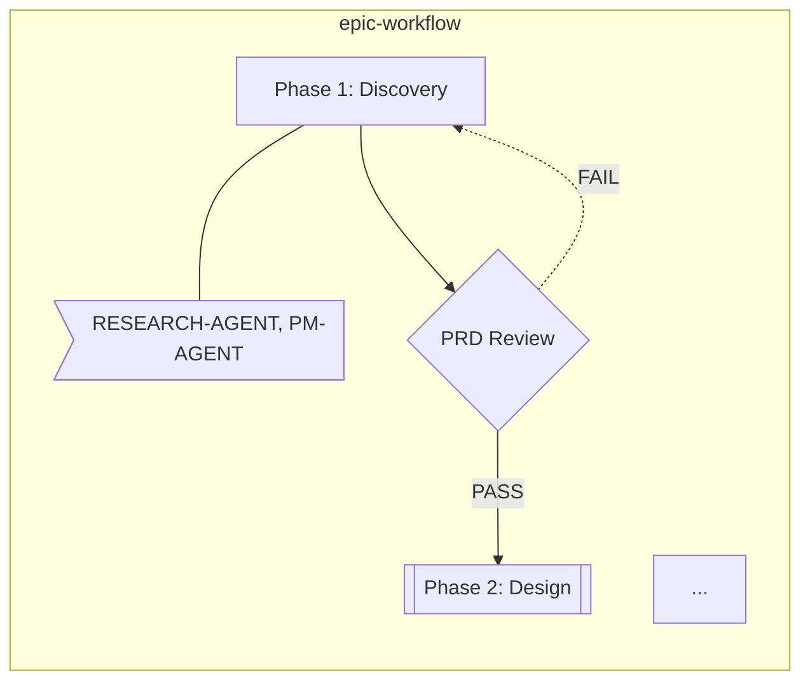

# Automation Scripts

This directory contains automation scripts for the Agent Methodology Pack.

## Available Scripts

### 1. validate-docs.sh
**Purpose:** Validates the complete project structure

**Usage:**
```bash
bash scripts/validate-docs.sh
```

**What it checks:**
- Core files (CLAUDE.md, PROJECT-STATE.md, README.md, etc.)
- CLAUDE.md line count (must be ≤70 lines)
- Complete folder structure
- All agent definition files
- State files
- Pattern files
- Configuration files
- Template files
- @references validation (checks if referenced files exist)
- Workflow files

**Output:**
- Colored output with ✅ for success, ⚠️ for warnings, ❌ for errors
- Summary with error/warning/success counts
- Exit code 1 on errors, 0 on success

**Example output:**
```
╔════════════════════════════════════════════════════════════╗
║         AGENT METHODOLOGY PACK - VALIDATION SCRIPT         ║
╚════════════════════════════════════════════════════════════╝

━━━━━━━━━━━━━━━━━━━━━━━━━━━━━━━━━━━━━━━━━━━━━━━━━━━━━━━━━━━━
  1. Core Files
━━━━━━━━━━━━━━━━━━━━━━━━━━━━━━━━━━━━━━━━━━━━━━━━━━━━━━━━━━━━
✅ Root CLAUDE.md exists
✅ Root PROJECT-STATE.md exists
...
```

---

### 2. token-counter.sh
**Purpose:** Estimates token usage for context budget management

**Usage:**
```bash
# Standard output
bash scripts/token-counter.sh

# Verbose mode (shows per-file breakdown)
bash scripts/token-counter.sh --verbose
```

**What it analyzes:**
- Core files (CLAUDE.md, PROJECT-STATE.md)
- Agent definitions (Planning, Development, Quality)
- State files
- Patterns and workflows
- Configuration files
- Documentation

**Features:**
- Token estimation using chars/4 approximation
- Category breakdown
- Session budget analysis
- Warning for files >2000 tokens
- Recommendations based on total usage

**Example output:**
```
╔════════════════════════════════════════════════════════════╗
║            TOKEN COUNTER - CONTEXT BUDGET ANALYSIS         ║
╚════════════════════════════════════════════════════════════╝

━━━━━━━━━━━━━━━━━━━━━━━━━━━━━━━━━━━━━━━━━━━━━━━━━━━━━━━━━━━━
  SUMMARY
━━━━━━━━━━━━━━━━━━━━━━━━━━━━━━━━━━━━━━━━━━━━━━━━━━━━━━━━━━━━

Category Breakdown:
  Core Files:        500 tokens
  Agent Definitions: 12,000 tokens
  State Files:       2,500 tokens
  ...

═══════════════════════════════════════════════════════════
  TOTAL ESTIMATED TOKENS: 25,000
═══════════════════════════════════════════════════════════
```

---

### 3. sprint-transition.sh
**Purpose:** Automates sprint closure and new sprint initialization

**Usage:**
```bash
bash scripts/sprint-transition.sh <old_sprint> <new_sprint>

# Example: Transition from Sprint 1 to Sprint 2
bash scripts/sprint-transition.sh 1 2
```

**What it does:**

1. **Archives Completed Work**
   - Creates `docs/5-ARCHIVE/sprint-N/` directory
   - Copies completed epics from `docs/2-MANAGEMENT/epics/current/`
   - Saves state files (TASK-QUEUE, HANDOFFS, DECISION-LOG)

2. **Generates Sprint Summary**
   - Creates `sprint-N-summary.md` with template
   - Lists completed epics
   - Placeholder sections for metrics, achievements, learnings

3. **Saves Metrics**
   - Copies METRICS.md to archive

4. **Updates PROJECT-STATE.md**
   - Updates sprint number references
   - Creates backup of original file

5. **Creates New Sprint Folder**
   - Creates `docs/2-MANAGEMENT/sprints/sprint-N/`
   - Generates sprint planning template
   - Generates retrospective template

**Example:**
```bash
$ bash scripts/sprint-transition.sh 1 2

╔════════════════════════════════════════════════════════════╗
║              SPRINT TRANSITION AUTOMATION                  ║
╚════════════════════════════════════════════════════════════╝

Transitioning from Sprint 1 to Sprint 2

━━━━━━━━━━━━━━━━━━━━━━━━━━━━━━━━━━━━━━━━━━━━━━━━━━━━━━━━━━━━
  1. Archiving Completed Work
━━━━━━━━━━━━━━━━━━━━━━━━━━━━━━━━━━━━━━━━━━━━━━━━━━━━━━━━━━━━
✅ Archive directory created: docs/5-ARCHIVE/sprint-1
✅ Archived 3 epic(s)
...
```

---

### 4. init-interactive.sh
**Purpose:** Interactive setup wizard for new or existing projects

**Usage:**
```bash
bash scripts/init-interactive.sh
```

**Features:**
- Colorful menu-driven interface
- Three main options:
  1. **Create NEW project** - Runs init-project.sh with guided prompts
  2. **Migrate EXISTING project** - Analyzes and offers migration
  3. **AUDIT ONLY** - Generates report without making changes

**What it does:**

**New Project Flow:**
- Prompts for project name
- Validates input (alphanumeric, hyphens, underscores only)
- Confirms before initialization
- Runs init-project.sh

**Existing Project Flow:**
- Prompts for project path
- Runs analyze-project.sh
- Shows audit summary
- Offers migration option
- Provides recommendations

**Audit Only Flow:**
- Analyzes project structure
- Generates comprehensive report
- Offers to view report immediately
- No changes made to project

**Example:**
```bash
$ bash scripts/init-interactive.sh

╔════════════════════════════════════════════════════════════╗
║       AGENT METHODOLOGY PACK - INTERACTIVE SETUP           ║
╚════════════════════════════════════════════════════════════╝

Welcome to the Agent Methodology Pack Setup Wizard!

━━━━━━━━━━━━━━━━━━━━━━━━━━━━━━━━━━━━━━━━━━━━━━━━━━━━━━━━━━━━
  What would you like to do?
━━━━━━━━━━━━━━━━━━━━━━━━━━━━━━━━━━━━━━━━━━━━━━━━━━━━━━━━━━━━

  [1] Create NEW project (initialize from scratch)
  [2] Migrate EXISTING project (analyze and migrate)
  [3] AUDIT ONLY (analyze without changes)
  [4] Exit

Select option [1-4]:
```

---

### 5. analyze-project.sh
**Purpose:** Scans existing projects and generates comprehensive audit reports

**Usage:**
```bash
bash scripts/analyze-project.sh [project-path] [--output output-dir]

# Analyze current directory
bash scripts/analyze-project.sh

# Analyze specific project
bash scripts/analyze-project.sh /path/to/project

# Custom output location
bash scripts/analyze-project.sh . --output .claude/audit
```

**What it analyzes:**

1. **Tech Stack Detection**
   - Detects Flutter/Dart, React, Next.js, Vue.js, Node.js
   - Python (Django), Go, Ruby (Rails), Java, Rust
   - Identifies package managers

2. **Project Structure**
   - Counts total files and documentation files
   - Excludes node_modules, .git, build directories

3. **Large Files**
   - Finds files >500 lines or >20KB
   - Recommends sharding strategy

4. **Documentation Audit**
   - Lists all markdown files
   - Analyzes size and complexity
   - Recommends keep vs. split

5. **Token Estimation**
   - Estimates total project tokens
   - Uses ~4 chars per token approximation

6. **Documentation Mapping**
   - Suggests where files should go in documentation structure
   - Identifies missing core files

**Generated Reports:**

1. **AUDIT-REPORT.md** - Comprehensive analysis with:
   - Summary statistics
   - Tech stack details
   - Documentation inventory
   - Large files list
   - Documentation structure recommendations
   - Missing files checklist
   - Next steps guide

2. **FILE-MAP.md** - Complete file listing with:
   - File paths
   - File types
   - Line counts
   - Size in KB
   - Estimated tokens

**Example output:**
```bash
╔════════════════════════════════════════════════════════════╗
║           PROJECT ANALYSIS - AGENT METHODOLOGY PACK        ║
╚════════════════════════════════════════════════════════════╝

━━━━━━━━━━━━━━━━━━━━━━━━━━━━━━━━━━━━━━━━━━━━━━━━━━━━━━━━━━━━
  1. Detecting Tech Stack
━━━━━━━━━━━━━━━━━━━━━━━━━━━━━━━━━━━━━━━━━━━━━━━━━━━━━━━━━━━━
✅ Detected: Flutter/Dart

━━━━━━━━━━━━━━━━━━━━━━━━━━━━━━━━━━━━━━━━━━━━━━━━━━━━━━━━━━━━
  2. Scanning Project Structure
━━━━━━━━━━━━━━━━━━━━━━━━━━━━━━━━━━━━━━━━━━━━━━━━━━━━━━━━━━━━
ℹ️  Total files: 1,247
ℹ️  Markdown files: 42
...
```

---

### 6. generate-workspaces.sh
**Purpose:** Generates agent-specific workspace directories with context links

**Usage:**
```bash
bash scripts/generate-workspaces.sh [project-path] [--agents agent1,agent2,...]

# Generate all agent workspaces
bash scripts/generate-workspaces.sh

# Generate specific agents only
bash scripts/generate-workspaces.sh . --agents BACKEND-DEV,FRONTEND-DEV,TEST-ENGINEER

# Generate for external project
bash scripts/generate-workspaces.sh /path/to/project
```

**What it creates:**

For each agent, generates in `.claude/state/workspaces/{AGENT}/`:

1. **CONTEXT.md** - Agent-specific context with:
   - Quick links to core files
   - Agent definition reference
   - Relevant documentation links
   - Auto-detected project files
   - Agent-specific patterns to follow
   - Auto-generated based on agent role

2. **RECENT-WORK.md** - Task tracking template with:
   - Current tasks table
   - Completed tasks log
   - Work log by date
   - Notes section

3. **NOTES.md** - Knowledge base template with:
   - Key learnings section
   - Common pitfalls
   - Best practices
   - Code snippets
   - Decision log
   - Resources

**Smart File Detection:**

- **BACKEND-DEV**: Finds API, services, repositories, migrations
- **FRONTEND-DEV**: Finds UI, screens, widgets, components
- **TEST-ENGINEER**: Finds test directories and test files
- **ARCHITECT-AGENT**: Finds architecture docs and ADRs
- **UX-DESIGNER**: Finds design files and assets
- **QA-AGENT**: Finds test plans and QA docs

**Available Agents:**

Planning: ORCHESTRATOR, RESEARCH-AGENT, PM-AGENT, SCRUM-MASTER, ARCHITECT-AGENT, UX-DESIGNER, PRODUCT-OWNER

Development: TEST-ENGINEER, BACKEND-DEV, FRONTEND-DEV, SENIOR-DEV

Quality: QA-AGENT, CODE-REVIEWER, TECH-WRITER

**Example output:**
```bash
╔════════════════════════════════════════════════════════════╗
║        GENERATE AGENT WORKSPACES - METHODOLOGY PACK        ║
╚════════════════════════════════════════════════════════════╝

━━━━━━━━━━━━━━━━━━━━━━━━━━━━━━━━━━━━━━━━━━━━━━━━━━━━━━━━━━━━
  Generating Workspaces
━━━━━━━━━━━━━━━━━━━━━━━━━━━━━━━━━━━━━━━━━━━━━━━━━━━━━━━━━━━━

▶ Creating workspace for ORCHESTRATOR...
✅ ORCHESTRATOR workspace created
▶ Creating workspace for BACKEND-DEV...
✅ BACKEND-DEV workspace created
...
```

---

### 7. init-project.sh
**Purpose:** Initializes a new project with the methodology pack

**Usage:**
```bash
bash scripts/init-project.sh <project-name> [--skip-git]

# Example
bash scripts/init-project.sh my-awesome-app

# Skip git initialization
bash scripts/init-project.sh my-awesome-app --skip-git
```

**What it does:**

1. **Creates Core Files**
   - Generates CLAUDE.md from template (or creates minimal version)
   - Generates PROJECT-STATE.md from template
   - Replaces {PROJECT_NAME} and {DATE} placeholders

2. **Verifies Folder Structure**
   - Creates all required directories if missing
   - Ensures proper hierarchy

3. **Initializes State Files**
   - Creates empty state files with headers
   - Sets initialization date

4. **Git Setup** (unless --skip-git)
   - Initializes git repository
   - Creates .gitignore
   - Creates initial commit

5. **Validation**
   - Runs validate-docs.sh to verify setup

6. **Generates Quick Start Guide**
   - Creates QUICK-START-{project-name}.md
   - Includes project structure, agent list, commands, next steps

**Example:**
```bash
$ bash scripts/init-project.sh todo-app

╔════════════════════════════════════════════════════════════╗
║          PROJECT INITIALIZATION - METHODOLOGY PACK         ║
╚════════════════════════════════════════════════════════════╝

Initializing project: todo-app

━━━━━━━━━━━━━━━━━━━━━━━━━━━━━━━━━━━━━━━━━━━━━━━━━━━━━━━━━━━━
  1. Creating CLAUDE.md
━━━━━━━━━━━━━━━━━━━━━━━━━━━━━━━━━━━━━━━━━━━━━━━━━━━━━━━━━━━━
✅ CLAUDE.md created
✅ CLAUDE.md is within 70-line limit (45 lines)
...
```

---

## Cross-Platform Compatibility

All scripts are designed to work on:
- **Windows**: Git Bash, WSL
- **macOS**: Terminal
- **Linux**: Bash shell

## Error Handling

All scripts include:
- `set -e` - Exit on error
- Input validation
- Colored error messages
- Helpful usage instructions
- Backup creation where appropriate

## Output Features

- **Colored output** for better readability
  - 🔵 Blue: Headers and info
  - 🟢 Green: Success messages
  - 🟡 Yellow: Warnings and recommendations
  - 🔴 Red: Errors
- **Progress indicators** (▶, ✅, ⚠️, ❌)
- **Summary sections** with statistics
- **Clear next steps** after completion

## Common Workflows

### Setting Up a New Project (Interactive)
```bash
# 1. Run interactive wizard
bash scripts/init-interactive.sh
# Choose option 1: Create NEW project
# Follow prompts

# 2. Generate agent workspaces
bash scripts/generate-workspaces.sh

# 3. Validate structure
bash scripts/validate-docs.sh

# 4. Check token budget
bash scripts/token-counter.sh
```

### Setting Up a New Project (Manual)
```bash
# 1. Initialize project directly
bash scripts/init-project.sh my-project

# 2. Generate workspaces
bash scripts/generate-workspaces.sh

# 3. Validate structure
bash scripts/validate-docs.sh

# 4. Check token budget
bash scripts/token-counter.sh
```

### Migrating an Existing Project
```bash
# 1. Analyze existing project
bash scripts/analyze-project.sh /path/to/project

# 2. Review audit report
cat /path/to/project/.claude/migration/AUDIT-REPORT.md

# 3. Set up directory structure (manually based on recommendations)
mkdir -p .claude/{agents,patterns,state,workflows}
mkdir -p docs/{1-BASELINE,2-MANAGEMENT,3-ARCHITECTURE,4-DEVELOPMENT,5-ARCHIVE}

# 4. Generate workspaces
bash scripts/generate-workspaces.sh /path/to/project

# 5. Validate
bash scripts/validate-docs.sh
```

### Auditing a Project (No Changes)
```bash
# Quick audit via interactive menu
bash scripts/init-interactive.sh
# Choose option 3: AUDIT ONLY

# Or directly
bash scripts/analyze-project.sh /path/to/project --output .claude/audit
```

### Sprint Management
```bash
# At end of sprint
bash scripts/sprint-transition.sh 1 2

# Check archive
ls docs/5-ARCHIVE/sprint-1/
```

### Maintenance
```bash
# Regular validation
bash scripts/validate-docs.sh

# Monitor token usage
bash scripts/token-counter.sh --verbose
```

## Troubleshooting

### "Permission Denied" Error
```bash
# Make scripts executable
chmod +x scripts/*.sh
```

### Scripts Not Running on Windows
- Use Git Bash (comes with Git for Windows)
- Or use WSL (Windows Subsystem for Linux)

### Color Codes Not Showing
- Some terminals don't support ANSI color codes
- Scripts will still work, just without colors

## Contributing

When adding new scripts:
1. Follow the same header format
2. Include `set -e` for error handling
3. Add colored output for consistency
4. Include usage instructions in comments
5. Update this README

---

---

### 8. find-large-files.sh
**Purpose:** Finds files that need sharding based on size/lines

**Usage:**
```bash
# Scan current directory with defaults (>500 lines OR >20KB)
bash scripts/find-large-files.sh

# Scan specific directory
bash scripts/find-large-files.sh ./docs

# Custom thresholds
bash scripts/find-large-files.sh --min-lines 1000 --min-size 50

# Find large TypeScript files
bash scripts/find-large-files.sh ./src --type ts --min-lines 300
```

**Options:**
- `PATH` - Directory to scan (default: current directory)
- `--min-lines NUM` - Minimum line count threshold (default: 500)
- `--min-size NUM` - Minimum size in KB (default: 20)
- `--type EXT` - File extension to filter (default: md)
- `-h, --help` - Show help message

**What it does:**
- Scans directory for files exceeding thresholds
- Calculates line count, size, and estimated tokens
- Provides recommendations (SHARD NOW, SHARD SOON, CONSIDER)
- Shows potential token savings after sharding
- Lists files needing immediate attention

**Example output:**
```
╔════════════════════════════════════════════════════════════╗
║              LARGE FILE FINDER                              ║
╚════════════════════════════════════════════════════════════╝

Scanning: /path/to/project
Thresholds: >500 lines OR >20KB

LARGE FILES FOUND:

File                                                            Lines       Size       Tokens          Action
────────────────────────────────────────────────────────────────────────────────────────────────────────────────────
docs/architecture.md                                             2340        95KB       ~58,500         SHARD NOW
README.md                                                         890        35KB       ~22,250         SHARD SOON
docs/api-reference.md                                            1200        48KB       ~30,000         SHARD SOON

Summary:
  • Files needing attention: 3
  • Total estimated tokens: 110,750
  • Potential savings after sharding: ~66,450 tokens

⚠ IMMEDIATE ACTION NEEDED:
  • docs/architecture.md
```

**Token Estimation:**
- Conservative estimate: 1 line ≈ 25 tokens
- Estimated savings: ~60% reduction after sharding
- Helps prioritize which files to shard first

**Action Levels:**
- `SHARD NOW` (Red): >2000 lines or >100KB - Immediate action needed
- `SHARD SOON` (Yellow): >1000 lines or >50KB - Plan to shard
- `CONSIDER` (Green): >500 lines or >20KB - Monitor for growth

---

### 9. shard-document.sh
**Purpose:** Splits a large document into smaller focused files

**Usage:**
```bash
# Shard using default heading strategy
bash scripts/shard-document.sh docs/architecture.md

# Use smart strategy with custom max lines
bash scripts/shard-document.sh README.md --strategy smart --max-lines 400

# Dry run to preview changes (no files created)
bash scripts/shard-document.sh docs/api.md --dry-run

# Custom output directory
bash scripts/shard-document.sh guide.md --output docs/guide-parts
```

**Options:**
- `FILE` - File to shard (required)
- `--output DIR` - Output directory (default: {filename}-sharded/)
- `--max-lines NUM` - Maximum lines per shard (default: 300)
- `--strategy TYPE` - Sharding strategy (default: heading)
  - `heading`: Split at ## level headings (keeps sections together)
  - `fixed`: Split at fixed line counts (ignores structure)
  - `smart`: Combine heading + max-lines (split large sections)
- `--dry-run` - Preview what would be done without making changes
- `-h, --help` - Show help message

**What it does:**
1. Analyzes document structure (finds ## headings)
2. Splits based on chosen strategy
3. Creates output directory: `{filename}-sharded/`
4. Generates numbered shard files:
   - `00-index.md` - Overview + links to all sections
   - `01-{section-name}.md` - First section
   - `02-{section-name}.md` - Second section
   - etc.
5. Preserves original as `{filename}.original`
6. Reports statistics and savings

**Output Structure:**
```
docs/architecture-sharded/
├── 00-index.md          (Overview + navigation)
├── 01-overview.md       (180 lines)
├── 02-database.md       (350 lines)
├── 03-api-design.md     (290 lines)
├── 04-security.md       (220 lines)
└── 05-deployment.md     (310 lines)
```

**Strategy Comparison:**

| Strategy | Best For | Pros | Cons |
|----------|----------|------|------|
| `heading` | Well-structured docs with ## headings | Preserves logical sections | Large sections stay together |
| `fixed` | Uniform splitting, no structure | Predictable shard sizes | Ignores document structure |
| `smart` | Large sections that exceed max-lines | Balance structure + size | More complex splitting |

**Index File Example:**
```markdown
# Architecture (Index)

This document has been sharded for better AI context management.

## Sections

1. [Overview](./01-overview.md) - 180 lines
2. [Database](./02-database.md) - 350 lines
3. [API Design](./03-api-design.md) - 290 lines
4. [Security](./04-security.md) - 220 lines
5. [Deployment](./05-deployment.md) - 310 lines

## Quick Stats
- Original: 2340 lines
- Sharded: 6 files
- Largest section: 350 lines

---
*Sharded by shard-document.sh on 2025-12-05*
*Original file preserved as: architecture.md.original*
```

**Features:**
- Preserves original file as `.original` backup
- Smart heading detection (## level)
- Colorful progress output
- Dry-run mode for preview
- Slugified filenames (lowercase, hyphenated)
- Dependency chain analysis
- Token savings estimation

**Typical Workflow:**
1. Run `find-large-files.sh` to identify candidates
2. Run `shard-document.sh --dry-run` to preview
3. Review the shard preview and adjust `--max-lines` if needed
4. Run `shard-document.sh` to execute sharding
5. Update references to point to new sharded location
6. Delete or archive original file

---

## Script Summary Table

| Script | Purpose | When to Use |
|--------|---------|-------------|
| **init-interactive.sh** | Interactive setup wizard | First time setup, need guidance |
| **init-project.sh** | Direct project initialization | Quick setup, automation scripts |
| **analyze-project.sh** | Project audit and analysis | Existing projects, migration planning |
| **generate-workspaces.sh** | Create agent workspaces | After project setup, per-agent context |
| **validate-docs.sh** | Structure validation | After changes, pre-commit checks |
| **token-counter.sh** | Context budget analysis | Before agent sessions, optimization |
| **sprint-transition.sh** | Sprint archiving | End of sprint, start new sprint |
| **find-large-files.sh** | Find files needing sharding | Context optimization, doc maintenance |
| **shard-document.sh** | Split large files | After finding large files, token reduction |

---

### 10. migrate-docs.sh
**Purpose:** Migrates existing documentation to standard structure

**Usage:**
```bash
# Interactive migration
bash scripts/migrate-docs.sh ./old-docs

# Dry run to preview
bash scripts/migrate-docs.sh ./old-docs --dry-run

# Fully automated
bash scripts/migrate-docs.sh ./old-docs --auto

# Custom target directory
bash scripts/migrate-docs.sh ./old-docs --target documentation/
```

**Options:**
- `SOURCE_DIR` - Source directory containing existing docs (required)
- `--target DIR` - Target directory (default: docs/)
- `--dry-run` - Preview migration without making changes
- `--auto` - Auto-categorize without prompts
- `-h, --help` - Show help message

**What it does:**
1. Scans source directory for markdown files
2. Detects category based on filename and content patterns
3. Suggests appropriate documentation location
4. Interactive or automatic categorization
5. Moves files to new locations
6. Updates @references in moved files
7. Generates detailed migration report

**Category Detection:**
- `prd|requirements|product` → `docs/product/`
- `architecture|design|adr` → `docs/architecture/`
- `research` → `docs/research/`
- `epic` → `docs/epics/`
- `story` → `docs/stories/`
- `sprint` → `docs/sprints/`
- `api` → `docs/api/`
- `implementation` → `docs/implementation/`
- `test` → `docs/testing/`
- Default → `docs/archive/`

**Detection Algorithm:**
- Checks filename patterns (case-insensitive)
- Analyzes first 50 lines of content
- Searches for keywords (e.g., "PRD", "architecture", "user story")
- Applies categorization rules
- Suggests normalized filename

**Example output:**
```
╔════════════════════════════════════════════════════════════╗
║              DOCUMENTATION MIGRATION                       ║
╚════════════════════════════════════════════════════════════╝

Source: ./old-docs/
Target: ./docs/

━━━━━━━━━━━━━━━━━━━━━━━━━━━━━━━━━━━━━━━━━━━━━━━━━━━━━━━━━━━━
  3. Migration Plan
━━━━━━━━━━━━━━━━━━━━━━━━━━━━━━━━━━━━━━━━━━━━━━━━━━━━━━━━━━━━

| Source | Target | Action |
|--------|--------|--------|
| requirements.md | docs/1-BASELINE/product/requirements.md | MOVE |
| arch-overview.md | docs/1-BASELINE/architecture/overview.md | MOVE |
| sprint-1.md | docs/2-MANAGEMENT/sprints/sprint-1.md | MOVE |

Proceed? (y/n): y

━━━━━━━━━━━━━━━━━━━━━━━━━━━━━━━━━━━━━━━━━━━━━━━━━━━━━━━━━━━━
  5. Executing Migration
━━━━━━━━━━━━━━━━━━━━━━━━━━━━━━━━━━━━━━━━━━━━━━━━━━━━━━━━━━━━

▶ Migrating: requirements.md → docs/1-BASELINE/product/requirements.md
✅ Moved successfully
...

╔════════════════════════════════════════════════════════════╗
║        DOCUMENTATION MIGRATION COMPLETED                   ║
╚════════════════════════════════════════════════════════════╝

Migration Summary:
  ✅ Moved: 15
  ⚠️  Skipped: 0
  ❌ Errors: 0
```

**Generated Report:**
Creates `.claude/migration/MIGRATION-REPORT.md` with:
- Summary statistics
- Migration details (source → target → status)
- Category distribution
- Next steps

**Features:**
- Smart category detection from filenames and content
- Interactive confirmation (unless --auto)
- Dry-run mode for safe preview
- Updates @references in moved files
- Handles conflicts (skips if target exists)
- Creates directories as needed
- Detailed error reporting

**Typical Workflow:**
1. Run `analyze-project.sh` to understand current structure
2. Run `migrate-docs.sh --dry-run` to preview migration
3. Review migration plan
4. Run `migrate-docs.sh` to execute
5. Run `validate-migration.sh` to verify
6. Clean up source directory

---

### 11. validate-migration.sh
**Purpose:** Validates completed migration to Agent Methodology Pack structure

**Usage:**
```bash
# Basic validation
bash scripts/validate-migration.sh

# Validate specific project
bash scripts/validate-migration.sh /path/to/project

# Strict mode (fail on warnings)
bash scripts/validate-migration.sh --strict

# Auto-fix simple issues
bash scripts/validate-migration.sh --fix
```

**Options:**
- `PROJECT_PATH` - Path to project directory (default: current directory)
- `--strict` - Fail on warnings (exit code 1)
- `--fix` - Auto-fix simple issues
- `-h, --help` - Show help message

**What it checks:**

| # | Check | Description | Auto-Fix |
|---|-------|-------------|----------|
| 1 | Core files | CLAUDE.md, PROJECT-STATE.md exist | ❌ |
| 2 | Line count | CLAUDE.md < 70 lines | ❌ |
| 3 | @references | All references valid | ❌ |
| 4 | Docs structure | All required folders exist | ✅ |
| 5 | .claude structure | Agent folders exist | ✅ |
| 6 | Agent workspaces | 14 agents defined | ❌ |
| 7 | Memory bank | State files initialized | ❌ |
| 8 | Scripts | All scripts executable | ✅ |
| 9 | Orphan docs | No stray markdown files | ❌ |
| 10 | Large files | Files < 800 lines (warning) | ⚠️ |

**Validation Logic:**

**CLAUDE.md Line Count:**
- ≤70 lines: ✅ Pass
- 71-80 lines: ⚠️ Warning
- >80 lines: ❌ Fail

**Agent Workspaces:**
- 14 agents present: ✅ Pass
- 11-13 agents: ⚠️ Warning
- <11 agents: ❌ Fail

**@Reference Validation:**
- Extracts all @references from key files
- Checks if referenced files exist
- Reports broken references
- All valid: ✅ | 1-2 broken: ⚠️ | >2 broken: ❌

**Large File Detection:**
- Finds markdown files >800 lines
- Issues warning (not failure)
- Recommends sharding

**Example output:**
```
╔════════════════════════════════════════════════════════════╗
║              MIGRATION VALIDATION                          ║
╚════════════════════════════════════════════════════════════╝

ℹ️  Validating: /path/to/project

━━━━━━━━━━━━━━━━━━━━━━━━━━━━━━━━━━━━━━━━━━━━━━━━━━━━━━━━━━━━
  CHECKS
━━━━━━━━━━━━━━━━━━━━━━━━━━━━━━━━━━━━━━━━━━━━━━━━━━━━━━━━━━━━

[✅] CLAUDE.md exists (48 lines - OK)
[✅] PROJECT-STATE.md exists
[✅] Docs structure complete
[✅] .claude/ structure complete
[✅] 14 agent workspaces generated
[✅] Memory bank initialized
[⚠️] 2 large files found (consider sharding)
[✅] All @references valid (24 checked)
[✅] All scripts executable
[✅] No orphan documentation
[✅] No broken internal links

━━━━━━━━━━━━━━━━━━━━━━━━━━━━━━━━━━━━━━━━━━━━━━━━━━━━━━━━━━━━
  SUMMARY
━━━━━━━━━━━━━━━━━━━━━━━━━━━━━━━━━━━━━━━━━━━━━━━━━━━━━━━━━━━━

✅ Passed:   9
⚠️  Warnings: 1
❌ Failed:   0

━━━━━━━━━━━━━━━━━━━━━━━━━━━━━━━━━━━━━━━━━━━━━━━━━━━━━━━━━━━━
  RECOMMENDATIONS
━━━━━━━━━━━━━━━━━━━━━━━━━━━━━━━━━━━━━━━━━━━━━━━━━━━━━━━━━━━━

1. Consider sharding: docs/api-reference.md (1200 lines)
2. Consider sharding: docs/architecture.md (890 lines)

━━━━━━━━━━━━━━━━━━━━━━━━━━━━━━━━━━━━━━━━━━━━━━━━━━━━━━━━━━━━
  MIGRATION STATUS
━━━━━━━━━━━━━━━━━━━━━━━━━━━━━━━━━━━━━━━━━━━━━━━━━━━━━━━━━━━━

╔════════════════════════════════════════════════════════════╗
║             MIGRATION STATUS: COMPLETE ✅                  ║
╚════════════════════════════════════════════════════════════╝

━━━━━━━━━━━━━━━━━━━━━━━━━━━━━━━━━━━━━━━━━━━━━━━━━━━━━━━━━━━━
  NEXT STEPS
━━━━━━━━━━━━━━━━━━━━━━━━━━━━━━━━━━━━━━━━━━━━━━━━━━━━━━━━━━━━

1. Test agents: Load ORCHESTRATOR and describe a task
2. Run first sprint planning
3. Onboard team with QUICK-START.md
```

**Exit Codes:**
- `0` - Success (all checks passed or warnings only in non-strict mode)
- `1` - Failure (failed checks or warnings in strict mode)

**Auto-Fix Mode:**

Can fix:
- Missing directories (docs structure, .claude folders)
- Non-executable scripts
- Empty state files

Cannot fix:
- Missing core files (must be created manually)
- CLAUDE.md line count issues (requires manual editing)
- Broken @references (files must exist)
- Missing agent definitions (use generate-workspaces.sh)
- Large files (use shard-document.sh)

**Features:**
- Comprehensive 10-point validation
- Colorful status indicators (✅/⚠️/❌)
- Detailed recommendations for fixes
- Auto-fix mode for simple issues
- Strict mode for CI/CD integration
- Links to relevant documentation
- Clear next steps after validation

**Typical Workflow:**
1. Complete migration with `migrate-docs.sh`
2. Run `validate-migration.sh` to check structure
3. Review errors and warnings
4. Run `validate-migration.sh --fix` to auto-fix simple issues
5. Manually fix remaining issues
6. Re-run validation until all checks pass
7. Proceed with agent usage

---

## Script Summary Table

| Script | Purpose | When to Use |
|--------|---------|-------------|
| **init-interactive.sh** | Interactive setup wizard | First time setup, need guidance |
| **init-project.sh** | Direct project initialization | Quick setup, automation scripts |
| **analyze-project.sh** | Project audit and analysis | Existing projects, migration planning |
| **migrate-docs.sh** | Migrate docs to standard structure | After analyze, before validation |
| **validate-migration.sh** | Validate migration completion | After migration, pre-production |
| **generate-workspaces.sh** | Create agent workspaces | After project setup, per-agent context |
| **validate-docs.sh** | Structure validation | After changes, pre-commit checks |
| **token-counter.sh** | Context budget analysis | Before agent sessions, optimization |
| **sprint-transition.sh** | Sprint archiving | End of sprint, start new sprint |
| **find-large-files.sh** | Find files needing sharding | Context optimization, doc maintenance |
| **shard-document.sh** | Split large files | After finding large files, token reduction |
| **status.sh** | Quick status command | Check workflow/agent/task status |
| **visualize-workflow.sh** | Workflow visualization | Generate Mermaid diagrams from YAML |
| **agent-health.sh** | Agent health check | Validate agent files and readiness |

---

### 12. status.sh (Quick Status Command)
**Purpose:** Shows active workflows, agent status, and pending tasks in one command

**Usage:**
```bash
# Full status
bash scripts/status.sh

# One-liner summary
bash scripts/status.sh --compact

# JSON output for integration
bash scripts/status.sh --json

# Filter by type
bash scripts/status.sh --workflows  # Workflows only
bash scripts/status.sh --agents     # Agents only
bash scripts/status.sh --tasks      # Tasks only
```

**What it shows:**
- Active workflows with progress
- Agent status (active, waiting, blocked, ready)
- Pending tasks with priorities
- Pending handoffs
- Health status and alerts

**Example output:**
```
STATUS
======================================

Health: HEALTHY

Active Workflows: 2
  - Epic-1: In Progress

Active Agents: 3
  - BACKEND-DEV: Implementing RLS policies (E1-S1.2)
  - TEST-ENGINEER: Writing integration tests (E1-S1.1)
  - SCRUM-MASTER: Sprint planning (E1)

Pending Tasks: 4
  - [P0] Implement UI components from wireframes (E1-S1.3)
  - [P0] Refactor auth middleware (E1-S1.4)

Pending Handoffs: 2

[OK] No alerts

Last Updated: 2025-12-14 14:30
```

**Compact output:**
```
STATUS [OK] Workflows:2 | Agents: 3 active, 1 waiting, 0 blocked, 7 ready | Tasks: 4 pending | Handoffs: 2 pending
```

---

### 13. visualize-workflow.sh (Workflow Visualization)
**Purpose:** Generates Mermaid diagrams from workflow YAML files

**Usage:**
```bash
# Visualize specific workflow
bash scripts/visualize-workflow.sh epic-workflow.yaml
bash scripts/visualize-workflow.sh .claude/workflows/definitions/engineering/epic-workflow.yaml

# Visualize all workflows
bash scripts/visualize-workflow.sh --all

# Custom output file
bash scripts/visualize-workflow.sh epic-workflow.yaml --output docs/diagrams/epic-flow.md

# Output to stdout only (no file)
bash scripts/visualize-workflow.sh epic-workflow.yaml --stdout
```

**What it generates:**
- Mermaid flowchart diagram
- Phase nodes with agents
- Gates with pass/fail paths
- Parallel execution visualization
- Phase summary table

**Example output:**
```markdown
# epic-workflow - Workflow Diagram

> Complete workflow for delivering an epic from conception to completion



## Phases Summary

| # | Phase | Agents | Gate | Type |
|---|-------|--------|------|------|
| 1 | Discovery | RESEARCH-AGENT, PM-AGENT | PRD Review | APPROVAL_GATE |
| 2 | Design | ARCHITECT-AGENT, UX-DESIGNER | Design Review | REVIEW_GATE |
...
```

---

### 14. agent-health.sh (Agent Health Check)
**Purpose:** Validates agent files, frontmatter, and readiness

**Usage:**
```bash
# Check specific agent
bash scripts/agent-health.sh BACKEND-DEV
bash scripts/agent-health.sh research-agent

# Check all agents
bash scripts/agent-health.sh --all

# Quick summary only
bash scripts/agent-health.sh --all --summary

# JSON output
bash scripts/agent-health.sh BACKEND-DEV --json
```

**Health Checks performed:**
1. File exists and is readable
2. Has valid YAML frontmatter
3. Has required 'name' field
4. Has required 'tools' field
5. Has valid 'model' field (sonnet/opus/haiku)
6. Has 'description' field
7. Has '## Workflow' section
8. Has '## Interface' section
9. File size is reasonable (50-1000 lines)
10. No unfilled {{TODO}} placeholders
11. Has handoff protocols
12. Has error recovery section

**Health Status:**
- **HEALTHY** - All checks passed (exit code 0)
- **DEGRADED** - Warnings present but functional (exit code 1)
- **UNHEALTHY** - Critical issues, agent not usable (exit code 2)

**Example output:**
```
Agent Health Check: BACKEND-DEV
========================================
File: .claude/agents/development/BACKEND-DEV.md

  [OK] File exists and is readable
  [OK] YAML frontmatter present
  [OK] Name field: backend-dev
  [OK] Tools field defined: Read, Edit, Write, Bash, Grep, Glob
  [OK] Model field: sonnet
  [OK] Description: Backend developer agent...
  [OK] Workflow section present
  [OK] Interface section present
  [OK] File size OK (245 lines)
  [OK] No unfilled {{TODO}} placeholders
  [OK] Handoff protocols present
  [OK] Error recovery section present

----------------------------------------
Results: 12 passed, 0 warnings, 0 failed

[OK] BACKEND-DEV - HEALTHY
All checks passed. Agent is ready for use.
```

**Summary mode:**
```
[OK] BACKEND-DEV - HEALTHY (12/12 checks passed)
[OK] FRONTEND-DEV - HEALTHY (12/12 checks passed)
[!] RESEARCH-AGENT - DEGRADED (2 warnings)
[X] NEW-AGENT - UNHEALTHY (3 critical failures)
```

---

## Quick Wins Scripts Summary

These three scripts were added as Quick Wins (Features #17, #19, #24):

| Script | Feature # | ROI | Effort | Purpose |
|--------|-----------|-----|--------|---------|
| **status.sh** | #24 | 10x | 1 day | Quick visibility into system state |
| **visualize-workflow.sh** | #17 | 10x | 1-2 days | Visual understanding of workflows |
| **agent-health.sh** | #19 | 8x | 1-2 days | Reliability improvement |

---

**Version:** 1.3
**Author:** Agent Methodology Pack
**Last Updated:** 2025-12-14
